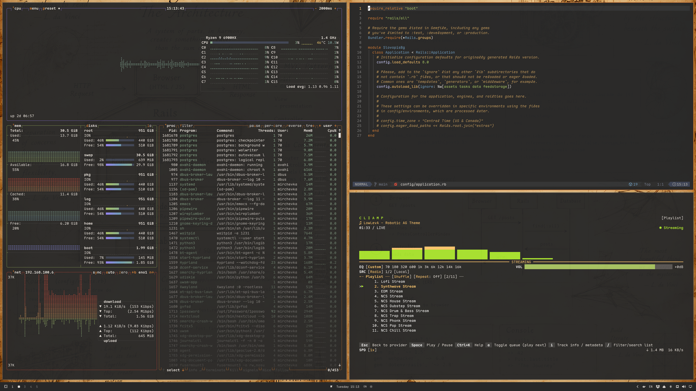
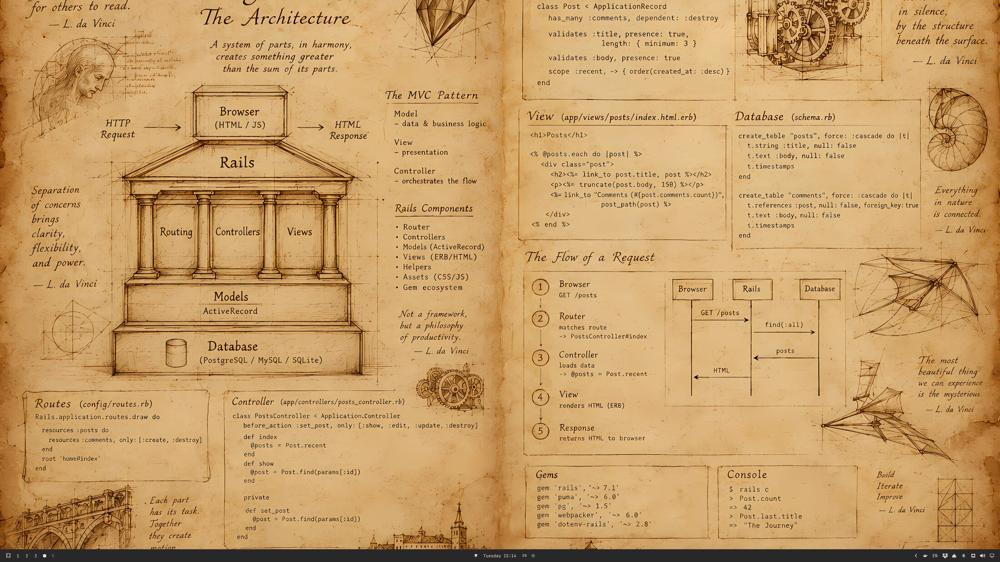

# RailsCasts Omarchy Theme

An [Omarchy](https://omarchy.org/) theme built from the original **RailsCasts** Sublime Text colour scheme — Ryan Bates' warm dark-grey and burnt-orange palette from the classic Ruby on Rails screencasts. Soft charcoal background, cream text, and the signature `#CC7833` orange accent, carried through the terminal, Hyprland, editors, and every app Omarchy themes.

## Palette

| Role | Hex |
|---|---|
| Background | `#282828` |
| Foreground | `#E6E1DC` |
| Accent / Orange | `#CC7833` |
| Red | `#DA4939` |
| Yellow | `#E8BF6A` |
| Green | `#A5C261` |
| Cyan | `#89AF90` |
| Blue | `#6D9CBE` |
| Magenta | `#967EFB` |
| Brown | `#675130` |

Full palette, including derived shades and bright variants, lives in [`colors.toml`](colors.toml).

## Screenshots




## Installation

```bash
omarchy theme set "Railscasts Omarchy Theme"
```

Or, to install from this repo elsewhere:

```bash
omarchy theme install https://github.com/kaloyanm/omarailscasts.git
```

## What's themed

- **Terminal** — Alacritty, Foot, Ghostty, Kitty, Warp (`warp.yaml`)
- **Hyprland** — window borders, `hyprlock.conf` (lock screen)
- **Omarchy shell** — bar, notifications, launcher, menu, polkit, and lock-screen chrome (`shell.toml`), with flat accent borders instead of the default Hyprland-gradient border to match RailsCasts' flat, single-accent look
- **Waybar** — full module styling (`waybar.css`) for anyone running it standalone instead of/alongside the Omarchy shell
- **Shell** — fish (`colors.fish`), fzf (`fzf.fish`)
- **Notifications & OSD** — mako (`mako.ini`), swayosd
- **Launchers** — Walker, Wofi, Vicinae
- **Desktop** — GTK apps, Qt6 apps (`qt6ct.conf`), icons (Yaru-yellow)
- **Editors** — Neovim ([`kaloyanm/railscasts-nvim`](https://github.com/kaloyanm/railscasts-nvim)), VS Code ([`RyanBates.railscasts-theme`](https://marketplace.visualstudio.com/items?itemName=RyanBates.railscasts-theme)), Zed
- **Browsers** — Firefox, Zen, Chromium
- **Misc** — Discord (Vencord), btop, Superfile, cava

Files with no dedicated per-theme override (`alacritty.toml`, `foot.ini`, `ghostty.conf`, `kitty.conf`, `hyprland.lua`, `btop.theme`, `helix.toml`, etc.) are generated automatically by Omarchy from `colors.toml` at theme-apply time — nothing to maintain there.

## Note on this repo's `.git`

Omarchy decides whether a user theme was "installed from a repo" purely by checking for a `.git` directory — it doesn't check the remote. Because this directory is a git repo, `omarchy theme set` will treat `neovim.lua` and `vscode.json` as untrusted and regenerate them from `colors.toml` instead of using the custom plugin/extension references committed here. If you want those two files applied as-is, remove `.git` from the theme directory Omarchy reads from (`~/.config/omarchy/themes/omarailscasts`), or keep your working copy elsewhere and copy the rendered files in.

## Source

Colours extracted from `RailsCasts Colour Scheme.sublime-package` (the original [RailsCasts](https://github.com/rails/rails) TextMate/Sublime scheme by Ryan Bates).

Some app configs adapted in structure (not colour) from other Omarchy community themes:
[Oxford](https://github.com/HANCORE-linux/omarchy-oxford-theme) and [Velvet Night](https://github.com/HANCORE-linux/omarchy-velvetnight-theme) by [HANCORE-linux](https://github.com/HANCORE-linux),
[Aamis](https://github.com/vyrx-dev/omarchy-aamis-theme) by [vyrx-dev](https://github.com/vyrx-dev),
[Black Arch](https://github.com/ankur311sudo/black_arch) by [ankur311sudo](https://github.com/ankur311sudo).

### License
MIT
